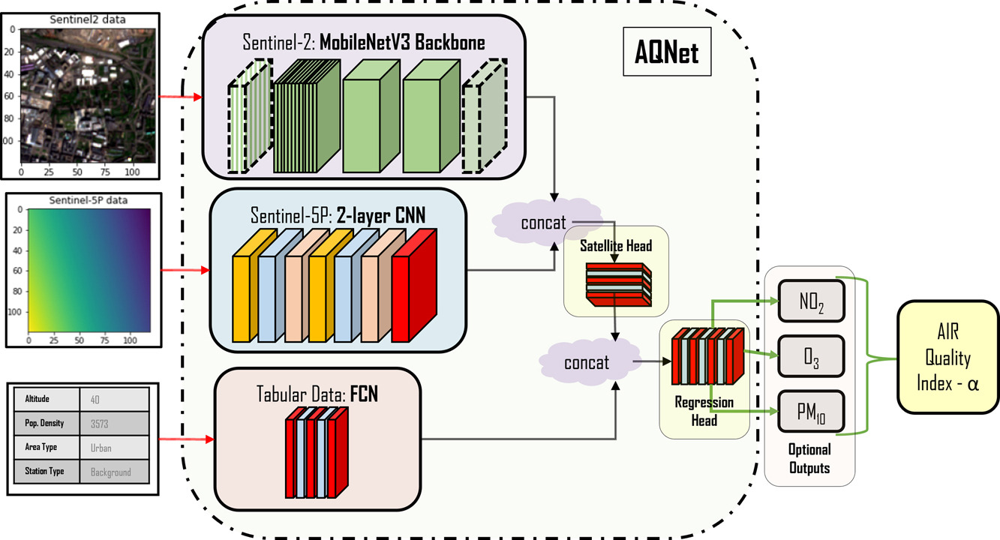

# AQNet - Predicting air quality via multimodal AI and satellite imagery

This repository presents Python files to reproduce the results published in our [paper](https://www.sciencedirect.com/science/article/pii/S0034425723001608)

## Abstract
*One of the most important major driving forces behind climate change and environmental issues that the Earth is currently facing is the pollution of the air which remains a key symptom of negative human influence on the environment. Air pollution is often invisible to the eye which can make its detection challenging, unlike the destruction of the land or waterways. Given that air-quality monitoring stations are typically ground-based, their abilities to detect pollutant distributions are often restricted to wide areas. Satellites, however, have the potential for studying the atmosphere at large; the European Space Agency (ESA) Copernicus project satellite, “Sentinel-5P” is a newly launched satellite capable of measuring a variety of pollutant information with publicly available data outputs. This paper seeks to create a multi-modal machine learning model for predicting air-quality metrics with high precision so that it will be applicable to locations where monitoring stations do not exist. The inputs of this model will include a fusion of ground measurements and satellite data with the goal of highlighting pollutant distribution and motivating change in societal and industrial behaviours. A contemporary method for fusing satellite information with pollution measurements is studied, suggesting that simpler models can work as effectively as neural network models that are constructed with state-of-the-art architectures. A new dataset of continental European pollution monitoring station measurements is created with features including altitude, population density, environmental classification of local areas, and satellite data from the ESA Copernicus project. This dataset is used to train a multi-modal ML model, **Air Quality Network (AQNet)** capable of fusing these various types of data sources to output predictions of various pollutants. These predictions are then aggregated to create an “air-quality index” that could be used to compare air quality over different regions. Three pollutants,* $N0_2$, $O_3$, *and* $PM10$, *are predicted successfully by AQNet and the network was found to be useful compared to a model only using satellite imagery. It was also found that the addition of supporting tabular data improves predictions. When testing the developed AQNet on out-of-sample data of the UK and Ireland, we obtain satisfactory estimates though on average pollution metrics were roughly overestimated by around 20%.*

<p align="center">
   
</p>

## AQNet Codes

**Folders and their content can be given below:**
```
These folders contain the documents necessary for regenerating outputs.

\Checkpoints
	 - One pretrained ResNet50 network from previous project.
	 - One multimodal, MobileNet backboned model for testing OOS cases.
\Datadir
	 - Folder to include Sentinel 2 and Sentinel 5P imagery from https://zenodo.org/record/5764262#.YfJiPS1XYUs 
\Data
	\data
		\basic
		  - Contains the original supporting data from the StGallen resources.
		\editted
		  - And here are sample lookups and generator created during this project to facilitate multioutput predictions.
	\timeseries_data
	  - Outputs from running the "discomap_extractor.ipynb" notebook, aggregated pollution measurements.
\Notebooks
	- Notebooks used in the the sourcing or testing of data in this project.

\Modules
	- Contains two subfolders, one for each iteration of testing/modelling.
	\SingleOutput
		- .py files for modelling with 1 pollutant with mulitmodal architecture
	\ThreeOutput
		- .py files for modelling with 3 pollutants with mulitmodal architecture
```

#### Installation Guide

The requirements are easily installed via
[Anaconda](https://www.anaconda.com/distribution/#download-section) (recommended):

```bash
conda create --name aqnet --file requirements.txt
```

After the installation is completed, activate the environment:
```bash
conda activate aqnet
```

#### Satellite Imagery Download
After setting up the environment, before running the experiments, You have to download Sentinel 2 and Sentinel 5P images. 

Please download satellite imagery files from [Scheibenreif et. al.](https://zenodo.org/record/5764262#.YfJiPS1XYUs) into `/Datadir` folder.

#### Example: 
**To train single output model without tabular data (AQNet (No Tabular)) for 40 epochs, run the following code from the `/Modules/SingleOutput` directory.
**
```
python training_single.py --epochs=40 --tabular=False
```

**To train single output model (AQNet-Single) for 10 epochs, run the following code from the `/Modules/SingleOutput` directory.
**
```
python training_single.py --epochs=10
```

**To train three output model (AQNet) for 20 epochs, run the following code from the `/Modules/ThreeOutput` directory.
**
```
python training_3poll.py --epochs=20
```

#### Reference
To cite our work, please use:
* Rowley, Andrew, and Oktay Karakuş. "Predicting air quality via multimodal AI and satellite imagery." Remote Sensing of Environment 293 (2023): 113609.*

```
@article{ROWLEY2023113609,
title = {Predicting air quality via multimodal AI and satellite imagery},
journal = {Remote Sensing of Environment},
volume = {293},
pages = {113609},
year = {2023},
issn = {0034-4257},
doi = {https://doi.org/10.1016/j.rse.2023.113609},
url = {https://www.sciencedirect.com/science/article/pii/S0034425723001608},
author = {Andrew Rowley and Oktay Karakuş}
}
```
